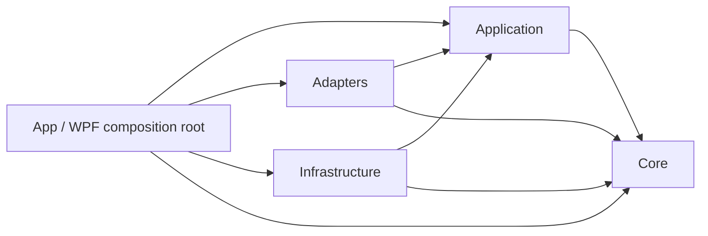

# 架构规则

本文是 ProviderPriceSwitcher 当前代码的长期工程规范。规则只描述已经建立并可验证的分层与依赖边界；实现与能力入口见 [`reuse.md`](reuse.md)，源代码、安全、持久化和 UI 细则见 [`coding.md`](coding.md)，构建、runner、WPF 烟测和发布验收见 [`build-release.md`](build-release.md)。

RFC 2119 关键词（`MUST`、`MUST NOT`、`SHOULD`、`MAY`）具有约束含义。

## 1. 分层职责

| 层 | 应放置的代码 | 明确不负责的事情 |
|---|---|---|
| **Core** | 价格、快照、成本、推荐规则及其纯领域契约；金额边界、同价选择、历史快照有效性等不依赖外部环境的规则 | UI、网络、文件、Windows API、进程启动、配置读写、供应商响应格式 |
| **Application** | 面向用户工作流的用例、应用契约、端口和编排：检查价格、站点/设置操作、OMP 切换与启动流程所需的抽象 | 具体供应商协议、HTTP 客户端实现、JSON 序列化、文件系统、DPAPI、WPF 或任何 Windows 实现 |
| **Adapters** | 供应商价格接口的协议适配器与注册描述：URL/响应解析、价格换算、分组交集、鉴权失败和超时的结构化映射 | WPF 控件、持久化、Windows 凭据存储、OMP 进程启动；不得把供应商细节泄露给 UI |
| **Infrastructure** | Application 端口的外部实现：设置/快照持久化、备份与原子写入、Windows 安全存储（DPAPI）、OMP 配置分析/替换、Windows Terminal 进程启动、日志实现 | 供应商适配器逻辑、价格刷新编排、WPF 页面/窗口；`Infrastructure` **MUST NOT** 引用 `Adapters` 或 `App` |
| **App** | WPF Window、View、ViewModel、用户输入校验、状态呈现、依赖注入和应用启动装配（composition root） | 价格计算、供应商 JSON 解析、文件/凭据/进程实现、绕过 Application 直接编排业务 |

测试项目是各层契约的 console runner，不改变生产分层。测试可引用被测层及其必要的测试替身；测试依赖不能反向成为生产依赖。

## 2. 生产依赖边界

生产引用图是固定契约，不得因方便调用而扩大：

### 2.1 允许/禁止依赖矩阵

表中“允许”表示生产项目可以有直接项目引用；“禁止”表示不得新增直接引用、`using`、运行时反射依赖或通过静态/复制代码绕过边界。

| 引用方 \ 被引用方 | Core | Application | Adapters | Infrastructure | App |
|---|---:|---:|---:|---:|---:|
| **Core** | — | 禁止 | 禁止 | 禁止 | 禁止 |
| **Application** | 允许 | — | 禁止 | 禁止 | 禁止 |
| **Adapters** | 允许 | 允许 | — | 禁止 | 禁止 |
| **Infrastructure** | 允许 | 允许 | **禁止** | — | **禁止** |
| **App** | 允许 | 允许 | 允许 | 允许 | — |

因此：

- `Application → Core` 是唯一的应用内向依赖；Application 的公共抽象必须保持可被替换实现。
- `Adapters → Application + Core` 和 `Infrastructure → Application + Core` 是并列外部实现边界；两者不得互相调用。
- `App → Application + Adapters + Infrastructure + Core` 只表示装配和呈现所需的入口，不表示 App 可以承担这些层的职责。
- 任何新增箭头、反向引用、跨层静态访问或把实现类型塞进 Core/Application，均须拒绝，除非先调整本规范和所有受影响契约并完成迁移。

## 3. 关键边界规则

### 3.1 Core 与 Application

1. Core **MUST** 保持环境无关、可确定、可独立验证；领域计算不能读取系统时钟、环境变量、文件或网络。
2. Application **MUST** 通过端口/契约表达外部能力，**MUST NOT** 在其中实现 WPF、Windows、文件系统、HTTP、JSON 或 DPAPI。
3. Application **MUST NOT** 引用 `System.Windows*`、Windows 注册表/凭据/进程 API、文件路径实现、HTTP 客户端实现、JSON 序列化库或 `ProtectedData`。需要这些能力时，只能定义端口，由 Adapters/Infrastructure 提供实现。
4. Application **SHOULD** 只编排用例和转换边界数据；价格、金额、快照和推荐判定应复用 Core，不得重复实现。

### 3.2 Adapters

1. 供应商协议、端点、响应字段和鉴权细节 **MUST** 留在 Adapters；Application 和 App **MUST NOT** 解析供应商 JSON 或依赖供应商 DTO。
2. 新供应商 **MUST** 通过既有适配器描述/注册入口接入，能力入口以 [`reuse.md`](reuse.md) 为准；不得在 Window、刷新服务或用例中增加供应商分支。
3. 适配器 **MUST** 将认证失败、超时、无效响应和不可推断的计费条件映射为既有结构化契约；**MUST NOT** 猜测复杂计费或静默降级成简单倍率。
4. Adapters **MUST NOT** 访问设置、快照、DPAPI、OMP 配置或启动进程；这些属于 Infrastructure 端口实现。

### 3.3 Infrastructure

1. Infrastructure **MUST** 实现 Application 定义的端口，并负责外部副作用的隔离、错误映射、备份和原子替换。
2. Infrastructure **MUST NOT** 引用 Adapters 或 App；不得通过类型转发、共享 UI 工程或复制适配器实现规避该禁令。
3. 凭据 **MUST** 使用既有 Windows 安全存储；Token/Cookie **MUST NOT** 进入设置、快照、日志、错误消息、备份或仓库。
4. OMP 配置切换 **MUST** 先备份再原子替换；启动失败不得静默回滚已完成的配置切换。仅用户明确操作才能执行切换和启动。

### 3.4 App 与 WPF

1. App 是 composition root：外部实现、adapter、Application 用例和查询端口的生产装配 **MUST** 集中在启动处，并将已构造依赖传入 Window/ViewModel；不得在窗口内恢复具体 Infrastructure 装配。
2. 使用 XAML Binding 的 Window **MUST** 有明确、可追踪的 `DataContext`（XAML 声明或构造时注入均可）；纯 programmatic code-behind 对话框可以不设 `DataContext`，但不得出现无来源的 Binding。不得依赖隐式全局服务定位器。
3. 新增 View/ViewModel 业务流程 **MUST** 调用 Application 用例；不得直接读写文件、调用 HTTP、DPAPI、OMP 配置或启动进程。`MainViewModel`、`SitesDialog` 与 `SiteEditorViewModel` 已只消费 Application 用例/窄契约；对话框实例由 composition root 注入的工厂创建，窗口不得恢复内部业务装配。
4. UI **MUST** 遵守“检查只推荐、不自动切换”；刷新失败沿用旧快照时不得参与自动推荐，当前组和最低组都必须保留展示。UI 细节引用 [`coding.md`](coding.md)。

## 4. Composition root 与运行方向

启动流程必须保持以下单向顺序：

1. App 读取启动参数并建立日志、数据根和外部环境配置。
2. App 创建 Infrastructure 实现（持久化、凭据、OMP 配置/进程）和 Adapters 注册表/适配器。
3. App 将实现注入 Application 用例；Application 仅依赖 Core 与端口。
4. App 创建 Window，并显式设置与用例绑定的 DataContext。
5. 用户触发检查、推荐、切换或启动；副作用经 Application 端口到达 Infrastructure/Adapters，结果再以契约返回 UI。

启动装配不得散落到 Window、ViewModel 或 Infrastructure。增加实现时应优先在 composition root 替换注册，而不是新增跨层引用。

### 4.1 当前边界债务

以下是文档编写时仍存在的已知例外，不构成新代码可复用的先例：

- `SitesDialog` 仍以 programmatic code-behind 构建大部分控件；新增界面不得把这种形态扩展为新的业务编排入口。

触及上述代码时遵循“先不扩大、能够顺手收敛则收敛”的原则；若迁移公开构造契约，必须一次性更新全部调用者与 runner。

## 5. Clean cutover 与契约演进

### 5.1 Clean cutover

架构迁移采用 clean cutover，但适用范围必须先区分：仓库内源码调用图默认一次性迁移；持久化 schema、外部 Provider API、已发布 CLI/扩展必须先定义兼容、版本和迁移窗口。适用 clean cutover 时，新端口/实现和全部调用方完成迁移后，旧路径必须删除，**MUST NOT** 保留兼容别名、过渡 re-export、双写、旧分支或“暂时”跨层引用。

迁移顺序为：
1. 判断是否为源码调用迁移，或触及持久化/外部 API/已发布消费者；后者先记录兼容、版本和迁移窗口。
2. 在正确层定义最小契约并补足契约验证。
3. 迁移所有适用的生产调用方和装配注册；调用方不得继续依赖旧类型。
4. 删除适用范围内的旧实现、旧入口和无效引用。
5. 按 [`build-release.md`](build-release.md) 的影响分级完成验证；只有发布任务或用户明确要求时才执行 publish。

### 5.2 契约演进

- **MUST** 先判断变更属于 Core 领域契约、Application 用例/端口、Adapters 协议映射、Infrastructure 外部实现还是 App 展示；放错层的变更应拒绝。
- 破坏性仓库内源码契约变更 **MUST** 在同一 clean cutover 中迁移所有实现、调用方和测试 runner；持久化 schema、外部 Provider API、已发布 CLI/扩展则 **MUST** 先采用明确版本/兼容/迁移策略。
- 可扩展字段 **SHOULD** 使用明确的不可变结果/选项和结构化失败，避免以 `null`、字符串错误或异常文本承载协议语义。
- 契约不得把 JSON、HTTP、WPF、Windows 类型或供应商 DTO 向内泄露；边界数据应为领域/Application 类型。
- 变更必须保留现有安全和业务不变量：不自动切换、有效快照限制推荐、复杂计费不猜测、凭据不落盘到非安全位置。

## 6. 何时拒绝变更与违规处理

以下任一情况出现时，审查者 **MUST** 拒绝变更，直到恢复边界：

- 新增依赖矩阵之外的项目引用、反向引用或跨层实现调用。
- Application 引入 WPF/Windows/文件系统/HTTP 实现/JSON/DPAPI。
- Infrastructure 引用 Adapters 或 App。
- App/Window 直接实现业务规则、协议解析、持久化、凭据处理或进程控制，或 Window 没有明确 DataContext。
- 用重复逻辑替代 [`reuse.md`](reuse.md) 中已有入口，或绕过 [`coding.md`](coding.md) 的安全/持久化规则。
- 以兼容别名、静默 fallback、双写或吞错方式逃避 clean cutover。
- 只修改文档/代码而不按 [`build-release.md`](build-release.md) 完成适用验证，或使用裸 `dotnet`、`dotnet test`。

发现违规后，**MUST**：记录违规层、依赖方向、受影响契约和复现证据；停止继续扩大变更；移除违规引用或把代码迁移到正确层；重新检查全部调用方和装配；最后按 [`build-release.md`](build-release.md) 完成适用的分级验证；只有发布任务或用户明确要求时才执行发布验收。不得通过压制警告、复制代码或增加隐藏反射来“修复”。

## 7. 变更审查清单

审查者在批准前 **MUST** 能逐项回答“是”：

- [ ] 代码放置层与职责表一致，Core/Application 没有环境副作用。
- [ ] 依赖只符合固定图和矩阵；没有新箭头、反向引用或隐式跨层调用。
- [ ] Application 没有 WPF、Windows、文件系统、HTTP 实现、JSON、DPAPI。
- [ ] Infrastructure 没有引用 Adapters/App；供应商协议仍封装在 Adapters。
- [ ] App 仅装配和呈现；每个 Window 有明确 DataContext，ViewModel 通过用例工作。
- [ ] 仓库内源码调用迁移完成 clean cutover；持久化 schema、外部 Provider API、已发布 CLI/扩展具有明确兼容/版本/迁移策略。
- [ ] 业务不变量仍成立：只推荐不自动切换、无效旧快照不推荐、复杂计费不猜测、凭据不泄露。
- [ ] 验证严格遵循 [`build-release.md`](build-release.md) 的影响分级；发布任务才完成双目录发布验收。

本清单任一项无法证明时，变更状态应为拒绝，而不是“先合并后补规范”。
