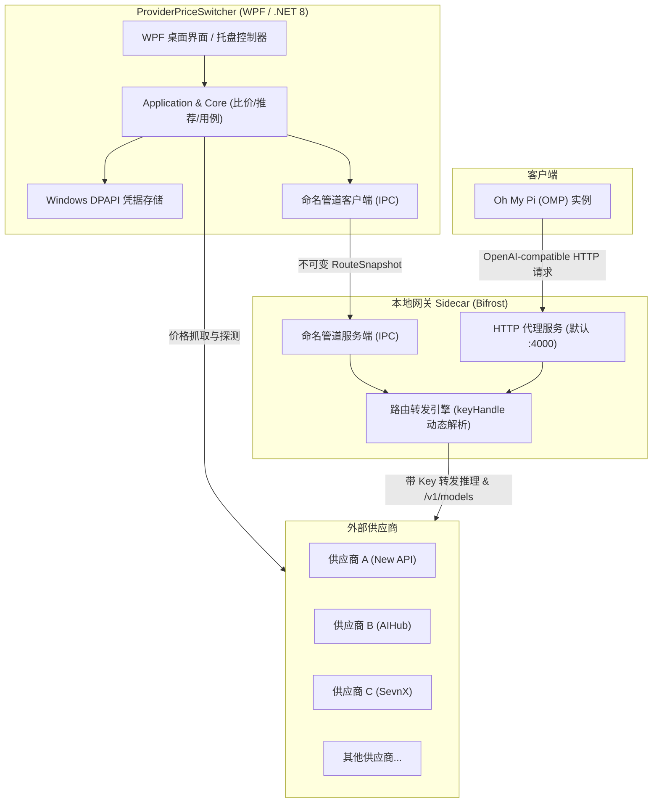

# ProviderPriceSwitcher

ProviderPriceSwitcher 是一个专为 [Oh My Pi (OMP)](https://github.com/canis-aur/oh-my-pi) 用户打造的 Windows 桌面工具。它支持自动查询和对比多个中转站/供应商的模型价格，按账户当前分组倍率计算综合成本并给出最低价推荐；在用户确认后，通过内置本地网关无缝接管 OMP 的推理请求与模型发现，无需频繁手动改写 OMP 配置文件或 API Key。

---

## 核心特性

- **多供应商价格查询与标准化**
  - 支持 New API、AIHub、SevnX、PawsAI 等多种中转站与聚合平台协议。
  - 自动提取并标准化输入、缓存读取与输出价格（统一以每百万 Token 的金额换算）。
  - 隔离单站探测失败，保留历史有效快照，不因个别站点网络故障阻断整体流程。

- **智能成本计算与比价推荐**
  - 以高缓存场景用量基准（当前基准模型为 `gpt-5.6-sol`）精确核算不同供应商在用户**当前绑定分组**下的真实调用成本。
  - 自动计算并推荐最低价供应商；同价时优先维持当前供应商。
  - 价格检查与推荐独立于路由生效：查价和推荐不会自动变更当前供应商，必须由用户显式点击确认应用。

- **透明本地网关与动态路由代理**
  - 内置基于 Bifrost 定制分支的 Windows 本地 Sidecar 网关，通过 Windows 私有命名管道（Named Pipe）实现安全 IPC 控制。
  - 向 OMP 暴露标准的 OpenAI-compatible 代理端点（默认 `http://127.0.0.1:4000/v1`）。
  - 支持模型发现（`/v1/models`）按当前选定供应商实时透明转发。
  - 支持 OpenAI Responses 非流式与流式 SSE、Tools / Tool Results、Reasoning 等特性。
  - 采用不可变路由快照机制：切换供应商时，在途请求继续使用旧路由直至完成，后续新请求即时接入新供应商，避免请求中断或混淆。

- **OMP GPT 路由一键替换与启动**
  - 提供独立的 OMP GPT 路由配置预览与替换功能：只精准改写主 `config.yml` 中以 `gpt` 开头的模型路由引用，保留非 GPT 路由（如 DeepSeek、Claude 等）的原供应商配置。
  - 支持在本地网关（`provider-price-switcher`）与官方直连（`openai-codex`）之间自由切换，并自动维护 `models.yml` 的 Provider 局部定义。
  - 支持直接在指定工作目录下启动 OMP 实例。

- **安全凭据存储**
  - 站点访问凭据（Cookie / Token）与推理 API Key 均使用 Windows DPAPI（当前用户安全存储）加密存储。
  - 敏感凭据绝不进入普通设置、价格快照、运行日志、异常提示或 UI 原文回填中；界面仅提供脱敏摘要展示与更新/清除操作。

- **桌面与托盘驻留**
  - 现代 WPF 桌面界面，关闭主窗口时自动最小化到系统托盘。
  - 托盘后台保持网关服务稳定运行；Sidecar 异常断开时具备自动恢复机制，重启后自动重新下发已确认的路由快照。

---

## 架构与工作原理



### 分层设计

- **`ProviderPriceSwitcher.Core`**：领域模型与纯业务计算。包含价格模型、分组、快照、成本计算器和推荐算法，无外部依赖。
- **`ProviderPriceSwitcher.Application`**：用例编排与接口契约。包含价格刷新、当前供应商切换、OMP 配置替换计划、设置管理及适配器注册表。
- **`ProviderPriceSwitcher.Adapters`**：外部中转站价格协议适配层。负责解析不同站点的计价规则、分组信息和价格表。
- **`ProviderPriceSwitcher.Infrastructure`**：基础设施实现。包含 Windows DPAPI 凭据存储、本地 JSON 存储、Bifrost Sidecar 进程守护与命名管道通信、OMP 配置文件（`config.yml` / `models.yml`）解析与替换。
- **`ProviderPriceSwitcher.App`**：WPF 桌面应用展现层。包含主窗口、站点管理、设置窗口、系统托盘以及依赖装配（Composition Root）。

---

## 支持的供应商协议

| 适配器标识 | 供应商类型 | 认证方式 | 价格端点 / 协议说明 |
|---|---|---|---|
| `new-api` | New API / One API 系列中转站 | 无需认证 | 公开端点 `/api/pricing`，支持复杂 Tier 计费函数解析与优先级倍率计算 |
| `aihub` | AIHub 平台 | 导入令牌 (Token) | `/api/v1/groups/available` 与 `/api/v1/groups/rates` 接口 |
| `sevnx` | SevnX 平台 | 导入令牌 (Token) | `/api/v1/model-pricing`、`/api/v1/groups/available` 与 `/api/v1/groups/rates` 接口 |
| `pawsai` | PawsAI 平台 | 无需认证 | 公开端点 `/pawsai-pricing.json` |

---

## 运行环境要求

- **操作系统**：Windows 10 / 11（x64）
- **运行时支持**：
  - 自包含版本（Self-Contained）：无需预装 .NET 运行时，开箱即用。
  - 框架依赖版本（Framework-Dependent）：需预装 [.NET 8 Desktop Runtime (x64)](https://dotnet.microsoft.com/download/dotnet/8.0)。
- **开发与构建**：.NET 8 SDK（`8.0.423` 或同主版本更新补丁）、PowerShell 7+ (`pwsh`)。

---

## 快速使用指南

### 1. 添加并配置供应商
1. 启动工具后，点击主界面的 **站点管理**。
2. 点击 **添加供应商**，填写供应商名称、Base URL、类型（如 New API / AIHub 等）。
3. 如站点需要身份验证方可查价，在“价格查询”段录入站点访问凭据（导入令牌）。
4. 在“模型推理”段录入该站点的推理 API Key，并指定当前绑定的账户分组。
5. 保存配置。

### 2. 检查价格与获取推荐
1. 在主界面点击 **检查价格**。
2. 系统将并发抓取各站点的最新价格与倍率，并在表格中清晰列出各站点的输入价、缓存读取价、输出价及当前分组。
3. 检查完成后，系统会自动高亮推荐综合成本最低的供应商作为“待应用目标”。

### 3. 应用当前供应商
1. 确认待应用的目标供应商无误后，点击底部的 **应用供应商**。
2. 本地网关即时加载该供应商的路由快照；后续所有发往本地网关的推理请求将自动打上该供应商的 API Key 并转发至其端点。

### 4. 替换 OMP 配置并启动
1. 在主界面右侧点击 **OMP 配置替换**。
2. 选择目标 Provider（`provider-price-switcher`），在弹出窗口中预览将被修改的 GPT 路由列表，确认无误后点击确认写入。
3. 在主界面选择 OMP 工作目录，点击 **启动 OMP** 即可开始使用。

---

## 开发与构建

项目使用 PowerShell 脚本统一管理开发初始化、测试验证与分级发布。

### 1. 开发环境初始化

在仓库根目录下执行：

```powershell
pwsh eng/Initialize-Development.ps1
```

脚本将校验 .NET SDK 版本并还原依赖。

### 2. 运行分层验证测试

项目按 Clean Architecture 划分为多个独立的 Contract Runner：

```powershell
# 运行默认验证链
pwsh eng/Verify.ps1

# 跨层改动或发布前运行全量验证（包含全部 8 个 Runner）
pwsh eng/Verify.ps1 -Impact CrossLayer -AllRunners
```

各层 Runner 说明：
- `Core`：纯领域逻辑与价格/推荐计算验证。
- `Adapters`：各供应商价格解析与协议转换验证。
- `Application`：用例编排与接口交互验证。
- `Infrastructure`：DPAPI 凭据、文件持久化与进程通信验证。
- `OmpConfig`：OMP 配置文件（`config.yml` / `models.yml`）解析与替换验证。
- `OmpProcess`：OMP 进程启动与工作目录隔离验证。
- `Refresh`：价格刷新并发与隔离机制验证。
- `App`：WPF ViewModel 与主流程装配验证。

### 3. 发布打包

执行发布脚本生成发布产物：

```powershell
pwsh eng/Publish.ps1
```

发布产物将输出至 `artifacts/publish/`：
- `artifacts/publish/framework-dependent/`：框架依赖版（体积小，需目标机已安装 .NET 8 Desktop Runtime）。
- `artifacts/publish/self-contained/`：自包含版（自带完整运行时，单机直接运行）。

发布流程会自动校验并打包内置的 `bifrost-sidecar.exe` 及 SHA-256 校验清单。

---

## 许可证

本项目采用 [MIT License](LICENSE) 许可证。
